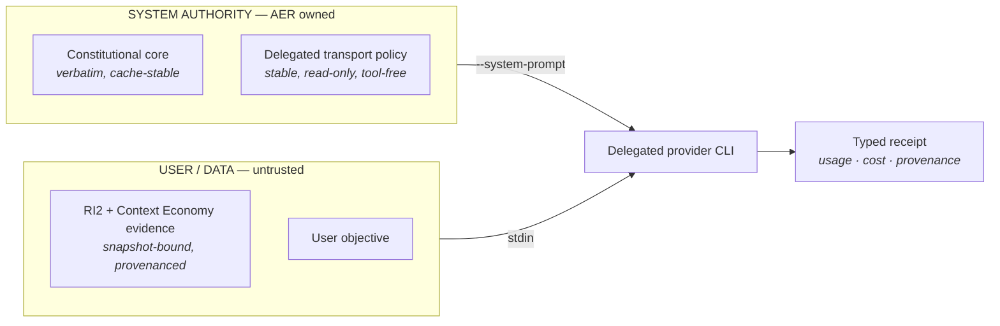

<div align="center">

# everything

**One CLI for work that spans everything.**

A local-first, model-agnostic engineering runtime that owns context, authority and evidence — and treats models as replaceable compute.

[](https://github.com/brutalstein/everything-cli/actions/workflows/ci.yml)


[Architecture](docs/) · [Implementation truth](STATUS.md) · [Build sequence](DEVELOPMENT_PLAN.md)

</div>

---

## What this is

`everything` is the public executable. **AER** — Adaptive Engineering Runtime — is the internal architecture name.

It is not a chat wrapper around a coding model. It is a control plane: it decides what a model sees, what a model may do, what counts as evidence, and what may be accepted as project truth. Providers plug into that plane. They do not define it.

> **models are replaceable compute; AER owns context, authority, resource budgets, execution boundaries, evidence and acceptance.**

Passing visible tests, generating more tokens, using more agents or obtaining a cheaper provider call is not sufficient by itself. The project optimizes **verified engineering outcome per unit cost**.

---

## The authority boundary

Every delegated model request is built from two layers that never mix. The separation is enforced by types, not by string convention — there is no constructor that accepts a pre-merged prompt, so retrieved repository text cannot be concatenated into system authority.



Repository content, retrieved code, tool output, user text and mutable project state stay in the data layer on every provider — including providers that expose no separate system channel. Quoted instructions inside evidence are data. They cannot grant permissions, widen the capability ceiling or override the core.

Authority size is bounded, and exceeding the bound **fails closed** rather than truncating authority or spilling it into the data layer.

---

## Current state

| | |
|---|---|
| **Sequence position** | Steps 01–13 complete of 18 |
| **Active work** | Provider Runtime Productization Gate (non-numbered, between 13 and 14) |
| **Step 14** | Intentionally blocked until that gate closes |
| **Authoritative CI** | `foundation-ci` — Linux and Windows jobs, both required |

The merged runtime includes:

| Layer | Capability |
|---|---|
| **Contracts** | Executable Draft 2020-12 contracts with semantic validation |
| **State** | Crash-safe SQLite WAL, append-only events, content-addressed objects, deterministic replay |
| **Runtime** | State machines, leases, cancellation, bounded queues, hard resource admission |
| **Workspace** | Exact identity, dirty-state capture, AER-owned isolated Git worktrees |
| **Execution** | Typed bounded process execution and environment fingerprinting |
| **Engineering** | Intent + Research + Engineering IR |
| **Knowledge** | Repository Intelligence 2.0 and the Context Economy Engine |
| **Verification** | Proof-carrying independent verification |
| **Providers** | Resilience, cost routing, truthful telemetry, delegated onboarding |
| **Horizon** | Long-horizon engineering state and recovery |
| **Parallelism** | Bounded parallel execution with isolated worktrees and integration verification |
| **Authority** | AER-owned permission policy and typed ToolBroker foundations |

---

## Provider runtime

Authentication, transport, model context and tool authority are four separate trust decisions. AER keeps them separate.

| Provider | Posture |
|---|---|
| **Claude Code** | Delegated authenticated calls supported under AER isolation controls. Current target-machine live-validation provider. |
| **Codex** | Delegated adapter, login and smoke implemented. Executable and account availability is machine-dependent. |
| **Gemini CLI** | Discovery and login supported. Delegated calls **fail closed** — its OAuth/user-state boundary cannot yet be separated from provider-local behavior strongly enough. |

Vendor-owned login stays vendor-owned. `everything` does not scrape or copy consumer OAuth refresh secrets, and it does not treat a provider's own configuration as AER authority.

```text
everything providers
everything provider status [codex|claude|gemini]
everything provider login <provider>
everything provider login codex --device
everything provider logout <provider>
everything provider smoke <provider> --show-input --prompt "..."
everything provider smoke <provider> --json --prompt "..."
everything provider benchmark <provider> --runs 3 --json
```

### Authority split — in production for Claude

A controlled cache-attribution lab rejected the obvious explanation first: stabilizing the scratch working directory did **not** materially improve cache reuse. What did was replacing the vendor's generic coding-agent preset with an AER-owned constitutional authority while keeping evidence in the data layer.

That split is now how every production delegated Claude request is built. Tools stay disabled, permission mode stays `plan`, provider-local settings, hooks, skills, memory and MCP are not inherited, and sessions are not persisted. `--bare` is deliberately unused: it would bypass vendor-owned delegated authentication and hand the session shell and edit tools.

It was promoted because the live acceptance matrix passed on **correctness, adversarial authority defense and measurement validity** — not because it is cheaper.

**Measured, same canonical probe, target Windows:**

| Dimension | Retired vendor preset | Production authority split |
|---|---|---|
| Exact main-loop input | ~11.2k tokens | **7,144 tokens** (spread 0) |
| Fresh input | near zero | 2 tokens |
| Cache creation | ~6.9–7.1k | 4,272 |
| Cache read | ~4.2k | 2,870 |
| Provider-reported cost | ~$0.0466–0.0536 / call | **$0.029039 / call** |
| Model-visible digest | stable | stable |

Cache-read tokens fell alongside everything else because the whole request is smaller. A lower cache-read count is not a regression when more total input was removed than was lost from reads — and cache ratios are never treated as an engineering-quality score.

### Against Claude Code itself — pilot, not a verdict

A benchmark built to be able to lose was run against the vendor Claude Code runtime on the same pinned model, with deterministic verifiers and no judge model. **36 real provider calls, 12 per profile.** That is a pilot; it settles nothing on its own.

| Profile | Verified | Main input, median | Cost/task | Cost per **verified** success |
|---|---|---|---|---|
| Claude Code, native | 10/12 | 70,702 | $0.04372 | $0.05247 |
| Claude Code, given AER's payload | 11/12 | 15,957 | $0.05273 | $0.05753 |
| AER production | 11/12 | **7,214** | $0.03097 | **$0.03379** |

What the same run shows against AER, recorded because it is true:

- once its cache is warm, **native Claude Code was cheaper per task** than AER production ($0.02874 vs $0.02973); AER leads only per verified success;
- the middle profile processed 4.4× fewer tokens than the native one and still cost more, because cache writes bill above base rate and reads far below it. **Sending less context does not by itself cost less** — and AER's own transport rewrites its per-task evidence on every call.

Full contract, per-family results, the three benchmark defects this pilot exposed, and the reasons it cannot support a general cost claim: [`docs/48`](docs/48_CLAUDE_CODE_PARITY_BENCHMARK.md). Raw receipt: [`benchmarks/claude-parity`](benchmarks/claude-parity).

---

## Quickstart

**Prerequisites** — Git · `rustup` · MSVC build tools with the native x64 C++ toolchain.

```powershell
git pull --ff-only
.\scripts\verify-windows.ps1 -SkipToolchainInstall
```

The verifier pins the repository's Windows MSVC toolchain, neutralizes conflicting Cargo/Rust/linker overrides, runs the locked correctness gates in an isolated target directory and builds the product. Success ends with exactly one line:

```text
everything Windows verification: PASS
```

Then launch it:

```powershell
& ".\target\verify-windows-msvc\x86_64-pc-windows-msvc\debug\everything.exe"
```

---

## Using it

### Interactive

There is no full-screen TUI, and that is deliberate. A bare launch starts a small line-oriented shell that avoids alternate-screen rendering and does no eager architecture or provider work. The entry screen states only what is already known — where it is pointed, and what authority the session starts with — because the first frame should not pay for state you did not ask for.

```text
everything ─────────────────────────────────────────────────────────────────────
workspace   C:\path\to\repo
permission  default · reads automatic, other eligible actions ask

/help for commands · /quit to exit

❯
```

<table>
<tr><td valign="top">

**Inspect**

```text
/status
/workspace
/intent
/ir
/research
/runs
/providers
/doctor
/permission
/provider ...
```

</td><td valign="top">

**Shape the work**

```text
/goal <text>
/non-goal <text>
/constraint <text>
/accept <text>
/assumption <text>
/quality <text>
/decision <text>
/research-import <artifact.json>
```

</td></tr>
</table>

The shell projects existing application and runtime state. It does not maintain a second UI-specific authority model.

Rendering adapts to the terminal it actually has. Color obeys `--color auto|always|never`, `NO_COLOR` and `TERM=dumb`; every glyph has an ASCII fallback and every status carries a text label, so nothing means anything only through color; and on a narrow terminal alignment padding and panel borders are dropped rather than allowed to overflow. Piped output stays plain and copyable.

### Headless

The same binary is scriptable, and every inspection command speaks JSON.

```powershell
$everything = ".\target\verify-windows-msvc\x86_64-pc-windows-msvc\debug\everything.exe"

& $everything status --json
& $everything workspace --json
& $everything intent --json
& $everything ir --json
& $everything research --json
& $everything runs --json
& $everything provider status claude --json
& $everything doctor --json
```

Point it at another repository without changing directory:

```powershell
& $everything --workspace C:\path\to\repo status
```

---

## Verification discipline

Deterministic CI proves parsers, policy, context construction, permission and tool invariants, resource bounds and fail-closed behavior — with no credentials and no paid calls.

Live provider acceptance is a **separate** product gate, because it makes real provider calls. Inspect what retrieval selected before paying for anything:

```powershell
.\scripts\run-provider-acceptance-windows.ps1 -Runs 2
```

Then, only when the selected evidence is valid:

```powershell
$out = Join-Path $env:TEMP "aer-provider-acceptance.json"

.\scripts\run-provider-acceptance-windows.ps1 -Runs 2 -Live -Json |
    Tee-Object -FilePath $out
```

The matrix runs repository facts, architecture authority and an adversarial repository prompt-injection case against the production transport and against a retained, clearly labelled non-production reproduction of the retired preset. Economic improvement alone cannot promote a transport, and a failing matrix is grounds for rollback, not for relabelling.

---

## What is not claimed

Honesty about the boundary is part of the contract. `everything` does **not** currently claim:

- Provider Runtime Productization Gate completion;
- a strong sandbox for unrestricted provider-native agentic process execution — delegated calls still run as ordinary host processes;
- universal exact semantic understanding for every programming language;
- that provider prompt-cache ratios are an engineering-quality score;
- that it is cheaper than Claude Code in general — a 12-sample pilot in one cache mode cannot carry that, and the native product won a metric in it;
- that fewer input tokens implies lower cost — the same pilot shows it does not;
- that it resists prompt injection better than Claude Code — that comparison was not validly measured;
- that Step 14 has started.

Current blockers and the exact next-action order live in [`STATUS.md`](STATUS.md).

---

## Architecture map

Implementation follows the precedence and change discipline in [`docs/00_READ_ME_FIRST.md`](docs/00_READ_ME_FIRST.md). Documents are normative; this README is not.

| Document | Owns |
|---|---|
| [`docs/00_READ_ME_FIRST.md`](docs/00_READ_ME_FIRST.md) | Authority order and change discipline |
| [`docs/02_ARCHITECTURE_PRINCIPLES.md`](docs/02_ARCHITECTURE_PRINCIPLES.md) | Standing architectural principles |
| [`docs/06_REPOSITORY_INTELLIGENCE.md`](docs/06_REPOSITORY_INTELLIGENCE.md) | Repository knowledge, source and provenance model |
| [`docs/07_CONTEXT_ECONOMY_ENGINE.md`](docs/07_CONTEXT_ECONOMY_ENGINE.md) | Bounded selection and progressive disclosure |
| [`docs/45_PROVIDER_AUTH_CONTEXT_PERMISSION_AND_TOOL_RUNTIME.md`](docs/45_PROVIDER_AUTH_CONTEXT_PERMISSION_AND_TOOL_RUNTIME.md) | Provider authority, isolation and runtime semantics |
| [`docs/46_PROVIDER_CONTEXT_ECONOMICS_BENCHMARK.md`](docs/46_PROVIDER_CONTEXT_ECONOMICS_BENCHMARK.md) | Context, cache and cost measurement contract |
| [`docs/47_PROVIDER_AUTHORITY_SPLIT_ACCEPTANCE.md`](docs/47_PROVIDER_AUTHORITY_SPLIT_ACCEPTANCE.md) | Claude authority-split acceptance gate |
| [`docs/48_CLAUDE_CODE_PARITY_BENCHMARK.md`](docs/48_CLAUDE_CODE_PARITY_BENCHMARK.md) | Cross-product comparison against Claude Code |
| [`STATUS.md`](STATUS.md) | Current implementation truth and blockers |
| [`DEVELOPMENT_PLAN.md`](DEVELOPMENT_PLAN.md) | The 18-step sequence and the provider gate |

<div align="center">
<sub>Built as an independent project. Not affiliated with, endorsed by, or a product of any model vendor.</sub>
</div>
