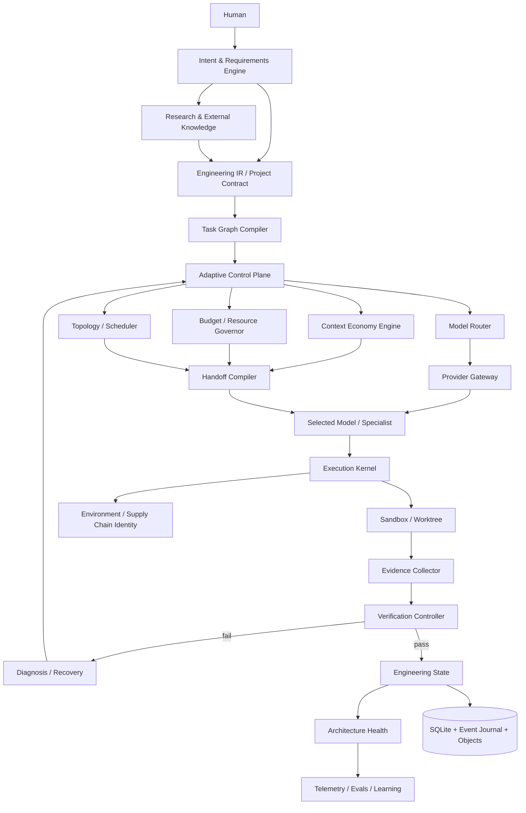

# Adaptive Engineering Runtime (AER) — Read This First

**Status:** Architecture baseline / implementation constitution  
**Baseline date:** 2026-08-15  
**Audience:** Coding agents (Claude Code, Codex, or equivalent), maintainers, reviewers, research engineers  
**Working name:** `AER` is a neutral codename. Product naming is intentionally deferred.

## 1. What this repository is intended to become

AER is a **model-agnostic adaptive software-engineering runtime**. It converts human intent into verified software while dynamically optimizing:

- specification quality,
- model selection,
- context selection,
- token and compute budgets,
- orchestration topology,
- tool use,
- execution isolation,
- verification strength,
- long-horizon codebase health,
- and reusable engineering state.

AER is **not** another prompt wrapper, fixed multi-agent workflow, or model-specific plugin.

The foundation model is a replaceable reasoning resource. The durable product is the runtime that controls what intelligence sees, what it may do, how much compute it receives, how work is coordinated, and what evidence is required before a change is accepted.

## 2. Highest-level product invariant

> AER MUST optimize for **verified engineering outcome per unit of cost**, not for number of agents, number of tokens, apparent activity, or benchmark-shaped test passing.

Non-negotiable consequences:

1. **Specification precedes implementation** for materially ambiguous work.
2. **Context is budgeted and provenance-preserving**, not dumped into the model.
3. **Single-agent execution is the default**; parallelism is earned by task structure.
4. **Verification is independent from generation** and stronger than visible tests alone.
5. **Long-horizon maintainability is continuously measured**, not deferred to a final review.
6. **Resources are bounded and admission-controlled**; adaptive orchestration may not create unbounded demand.
7. **Research, dependencies, providers, and external content are evidence inputs**, never hidden authority.
8. **Durable state and wire contracts evolve through explicit compatibility/migration rules.**
9. **Reproducibility includes environment and dependency identity**, not only repository commit.
10. **User-owned workspace/VCS state must be preserved by default.**

## 3. How a coding agent must use these docs

Do not read every document into context at once.

### Required first read

1. `00_READ_ME_FIRST.md`
2. `01_PRODUCT_THESIS_AND_NON_GOALS.md`
3. `02_ARCHITECTURE_PRINCIPLES.md`
4. `03_SYSTEM_ARCHITECTURE.md`
5. `25_IMPLEMENTATION_ROADMAP.md`
6. `26_AGENT_IMPLEMENTATION_PROTOCOL.md`
7. `35_ARCHITECTURE_COMPLETENESS_AUDIT.md`

### Then load only task-relevant docs

| Working area | Required docs |
|---|---|
| User interview / requirements | `04`, `05`, `36` when research resolves an unknown |
| Repository indexing / retrieval | `06`, `07` |
| Models / routing / provider execution / cost | `08`, `09`, `37` |
| Tasks / orchestration / parallelism / resources | `10`, `11`, `12`, `39` |
| Sandboxing / tools / protocols | `13`, `14` |
| State / memory / recovery | `15`, `16`, `24` |
| Verification / evidence / reproducibility | `17`, `38`, `43` |
| Code quality / architecture health | `18` |
| Security / data governance / tenancy | `19`, `42` |
| Telemetry / evals / self-evolution | `20`, `21`, `22` |
| CLI / UX | `23` |
| Storage / compatibility / migrations / releases | `24`, `40`, `44` |
| Workspace / git / integration lifecycle | `11`, `41` |
| Repo layout / implementation sequencing | `25`, `26`, `27` |
| Research rationale | `28_RESEARCH_EVIDENCE.md`, `36` |
| Configuration / policy | `29`, `44` |
| Open decisions | `30` |
| Final baseline decisions | `32` |
| End-to-end runtime behavior | `33` |
| Deterministic invariants/property tests | `34`, `39`, `40`, `41`, `44` |

## 4. Authority order

If documents conflict, use this precedence:

1. Explicit user instruction for the current task
2. `00_READ_ME_FIRST.md`
3. `02_ARCHITECTURE_PRINCIPLES.md`
4. Accepted ADRs under `adrs/`
5. Domain-specific architecture documents
6. `35_ARCHITECTURE_COMPLETENESS_AUDIT.md` for gap-closure requirements
7. Implementation roadmap
8. Examples

A coding agent MUST NOT silently resolve an architectural contradiction. It must record the conflict and either follow the higher-precedence source or propose an ADR.

## 5. Change discipline

Architecture changes MUST be explicit.

A change that alters any of the following requires an ADR:

- Engineering IR semantics,
- task lifecycle,
- evidence semantics,
- internal handoff/tool ABI,
- model-routing objective,
- context-selection objective,
- execution trust boundary,
- verifier independence rules,
- persistent state model,
- compatibility/migration promise,
- resource-admission invariant,
- external-research authority model,
- protocol compatibility promise.

Implementation details that preserve these contracts do not require an ADR.

## 6. System in one diagram

## 7. Core terms

- **Engineering IR:** canonical, model-independent representation of user intent and project constraints.
- **Task Envelope:** typed unit of engineering work.
- **Context Pack:** minimal, provenance-preserving context selected for one inference or task.
- **Handoff ABI:** structured model-to-model / agent-to-agent transfer format.
- **Engineering State:** authoritative derived state backed by an append-only event journal.
- **Evidence:** machine-checkable observation tied to immutable command/environment/source identity.
- **Proof Manifest:** requirement-to-change-to-evidence mapping for an accepted change.
- **Research Artifact:** provenance/freshness-bearing claims extracted from external knowledge.
- **Environment Fingerprint:** identity of the execution/toolchain/dependency environment behind evidence.
- **Resource Governor:** admission/backpressure authority for workers, providers, processes, services, budgets and queues.
- **Architecture Health:** continuously measured maintainability and structural integrity signals.
- **Policy:** versioned decision logic for routing, retrieval, scheduling, verification, recovery, research or other adaptive behavior.

## 8. What must not happen

AER MUST NOT:

- hard-code one model provider as product architecture;
- preload the whole repository or all skills into model context;
- spawn a fixed cast of planner/coder/reviewer agents for every task;
- treat model-generated summaries or web research as authoritative facts without provenance;
- treat passing visible tests as sufficient proof of user intent;
- allow the same writable verifier artifacts to be controlled by the generator;
- give an agent unrestricted host filesystem, credentials, Docker socket, or network by default;
- create unbounded task/model/tool/log queues;
- silently overwrite, reset, stash, or discard user-owned dirty workspace state;
- install dependencies without policy/provenance/reproducibility accounting;
- silently reinterpret old durable state after a binary/schema upgrade;
- accept unsigned/untrusted self-updates through model reasoning;
- autonomously deploy self-modified orchestration policies without evaluation gates;
- hide routing, context, cost, resource, migration, or verification decisions from observability.

## 9. Implementation philosophy

Start with the smallest architecture that preserves the final contracts.

Do not build distributed infrastructure before a local durable runtime works. Do not build learned routers before high-quality telemetry exists. Do not build multi-agent concurrency before single-agent state, resource admission, sandboxing, workspace safety, and verification are reliable. Do not build self-evolution before reproducible evals and release/migration safety exist.

The roadmap intentionally orders work this way.

## 10. Completeness rule

When introducing a new subsystem or public feature, apply the checklist in `35_ARCHITECTURE_COMPLETENESS_AUDIT.md`.

A high-impact feature is not architecture-complete until ownership, identity, lifecycle, failure/recovery, resource bounds, authority, data policy, compatibility, evidence, and observability are defined.
