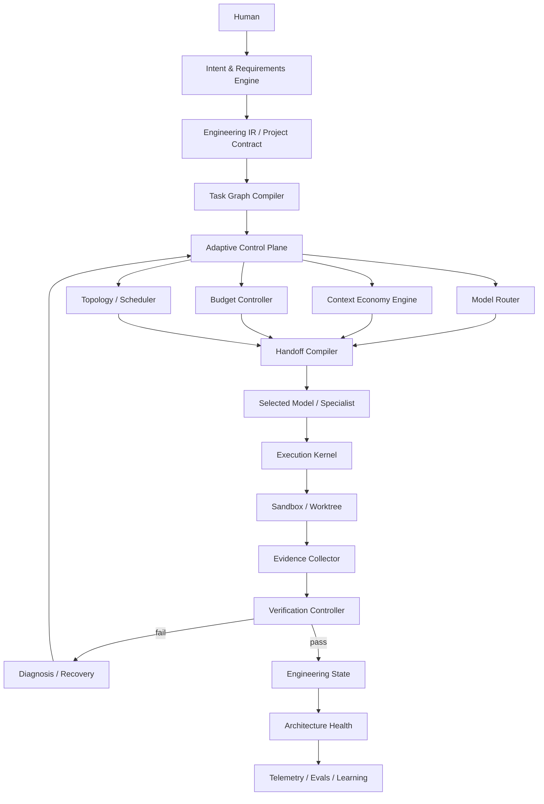

# Adaptive Engineering Runtime (AER) — Read This First

**Status:** Architecture baseline / implementation constitution  
**Baseline date:** 2026-08-15  
**Audience:** Coding agents (Claude Code, Codex, or equivalent), maintainers, reviewers, research engineers  
**Working name:** `AER` is a neutral codename. Product naming is intentionally deferred.

## 1. What this repository is intended to become

AER is a **model-agnostic adaptive software-engineering runtime**. It converts human intent into verified software while dynamically optimizing:

- specification quality,
- model selection,
- context selection,
- token and compute budgets,
- orchestration topology,
- tool use,
- execution isolation,
- verification strength,
- long-horizon codebase health,
- and reusable engineering state.

AER is **not** another prompt wrapper, fixed multi-agent workflow, or model-specific plugin.

The foundation model is treated as a replaceable reasoning resource. The durable product is the runtime that controls what intelligence sees, what it may do, how much compute it receives, how work is coordinated, and what evidence is required before a change is accepted.

## 2. Highest-level product invariant

> AER MUST optimize for **verified engineering outcome per unit of cost**, not for number of agents, number of tokens, apparent activity, or benchmark-shaped test passing.

This implies five non-negotiable properties:

1. **Specification precedes implementation** for materially ambiguous work.
2. **Context is budgeted and provenance-preserving**, not dumped into the model.
3. **Single-agent execution is the default**; parallelism is earned by task structure.
4. **Verification is independent from generation** and stronger than visible tests alone.
5. **Long-horizon maintainability is continuously measured**, not deferred to a final code review.

## 3. How a coding agent must use these docs

Do not read every document into context at once.

### Required first read

1. `00_READ_ME_FIRST.md`
2. `01_PRODUCT_THESIS_AND_NON_GOALS.md`
3. `02_ARCHITECTURE_PRINCIPLES.md`
4. `03_SYSTEM_ARCHITECTURE.md`
5. `25_IMPLEMENTATION_ROADMAP.md`
6. `26_AGENT_IMPLEMENTATION_PROTOCOL.md`

### Then load only task-relevant docs

| Working area | Required docs |
|---|---|
| User interview / requirements | `04`, `05` |
| Repository indexing / retrieval | `06`, `07` |
| Models / routing / cost | `08`, `09` |
| Tasks / orchestration / parallelism | `10`, `11`, `12` |
| Sandboxing / tools / protocols | `13`, `14` |
| State / memory / recovery | `15`, `16` |
| Verification / evidence | `17` |
| Code quality / architecture health | `18` |
| Security | `19` |
| Telemetry / evals / self-evolution | `20`, `21`, `22` |
| CLI / storage / repo layout | `23`, `24`, `27` |
| Research rationale | `28_RESEARCH_EVIDENCE.md` |

## 4. Authority order

If documents conflict, use this precedence:

1. Explicit user instruction for the current task
2. `00_READ_ME_FIRST.md`
3. `02_ARCHITECTURE_PRINCIPLES.md`
4. Accepted ADRs under `adrs/`
5. Domain-specific architecture documents
6. Implementation roadmap
7. Examples

A coding agent MUST NOT silently resolve an architectural contradiction. It must record the conflict and either follow the higher-precedence source or propose an ADR.

## 5. Change discipline

Architecture changes MUST be explicit.

A change that alters any of the following requires an ADR:

- Engineering IR semantics
- task lifecycle
- evidence semantics
- internal handoff ABI
- model-routing objective
- context-selection objective
- execution trust boundary
- verifier independence rules
- persistent state model
- protocol compatibility promise

Implementation details that preserve these contracts do not require an ADR.

## 6. The system in one diagram

## 7. Core terms

- **Engineering IR:** canonical, model-independent representation of user intent and project constraints.
- **Task Envelope:** typed unit of engineering work.
- **Context Pack:** minimal, provenance-preserving context selected for one inference or task.
- **Handoff ABI:** structured model-to-model / agent-to-agent transfer format.
- **Engineering State:** authoritative derived state backed by an append-only event journal.
- **Evidence:** machine-checkable observation tied to an immutable command/environment/source identity.
- **Proof Manifest:** requirement-to-change-to-evidence mapping for an accepted change.
- **Architecture Health:** continuously measured maintainability and structural integrity signals.
- **Policy:** versioned decision logic for routing, retrieval, scheduling, verification, or recovery.

## 8. What must not happen

AER MUST NOT:

- hard-code one model provider as the product architecture;
- preload the whole repository or all skills into model context;
- spawn a fixed cast of planner/coder/reviewer agents for every task;
- treat model-generated summaries as authoritative facts without provenance;
- treat passing visible tests as sufficient proof of user intent;
- allow the same writable verifier artifacts to be controlled by the generator;
- give an agent unrestricted host filesystem, credentials, Docker socket, or network by default;
- autonomously deploy self-modified orchestration policies without evaluation gates;
- hide routing, context, cost, or verification decisions from observability.

## 9. Implementation philosophy

Start with the smallest architecture that preserves the final contracts.

Do not build distributed infrastructure before a local durable runtime works. Do not build learned routers before high-quality telemetry exists. Do not build multi-agent concurrency before single-agent state, sandboxing, and verification are reliable. Do not build self-evolution before reproducible evals exist.

The roadmap intentionally orders work this way.
