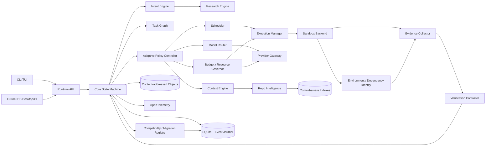

# System Architecture

## 1. Architectural style

AER uses a **typed local control plane + durable state + isolated execution workers** architecture.

Recommended implementation split:

- `aer-domain`: deterministic domain types, identities, schemas/state invariants;
- `aer-core`: orchestration application layer/control plane;
- `aerd`: local runtime daemon/app server;
- `aer`: CLI/TUI client;
- isolated worker/sandbox processes for model-driven execution;
- replaceable adapters for providers, repository intelligence, sandboxes, research, protocols, environment/supply-chain and verification;
- optional future clients (IDE, desktop, CI) using the same runtime API.

The product is the control system, not any one model SDK, TUI, database, vector store, or sandbox backend.

## 2. Recommended language strategy

### Core runtime: Rust

Use Rust for the durable core/runtime unless implementation evidence disproves the choice.

Reasons include memory safety for a tool-executing daemon, efficient concurrency, cross-platform distribution, strong process/filesystem control and typed contracts.

The core MUST NOT require Python for basic operation.

### Extension SDKs

Provide thin SDKs later for:

- TypeScript/JavaScript — integrations/client ecosystem;
- Python — research policies, experimental evaluators and ML retrieval components.

Extension languages interact through stable protocol boundaries rather than owning core correctness state.

## 3. Main components



## 4. Control plane vs execution plane

### Control plane owns decisions

- intent/spec resolution;
- external-research promotion;
- task graph;
- routing/provider eligibility;
- context policy;
- budgets/resource admission;
- scheduling/topology;
- verification policy;
- recovery;
- acceptance;
- compatibility/migration mode;
- authority/data policy.

### Data/execution plane performs work

- model calls;
- research fetches;
- shell/process commands;
- source edits;
- build/test execution;
- browser/external tool calls;
- package/dependency operations;
- worktree changes.

Execution components MUST NOT promote their own outputs to accepted state.

## 5. Authority boundaries

Text from users, repositories, web pages, model providers, MCP/A2A peers, packages and tool output is **data** until policy/validation grants a specific semantic role.

Authority comes from:

- explicit user/organization policy;
- accepted Engineering IR/ADRs;
- capability/security lattice;
- deterministic runtime state machines;
- independent verification.

Natural-language content cannot grant itself filesystem/network/credential/release authority.

## 6. Durability model

AER is resumable after daemon/client termination.

Every material transition is journaled before the corresponding externally observable state is considered durable.

Examples:

- project/spec/research artifact created;
- task created/leased;
- resource reservation admitted;
- routing/provider decision;
- model call started/completed;
- worktree/sandbox created;
- command/dependency operation completed;
- evidence recorded;
- verifier verdict;
- task accepted/rejected;
- migration state;
- policy/release metadata applied.

Large payloads are content-addressed; events store hashes and typed metadata.

## 7. Runtime API

Prefer a typed, version-negotiated API generated from schema. Protocol Buffers + gRPC/Connect-style loopback remains a candidate, not a frozen transport.

Requirements:

- streaming semantic events;
- cancellation;
- resumability;
- request/causation IDs;
- protocol/feature negotiation;
- local authentication token/capability;
- stable headless semantics;
- future remote transport compatibility.

A direct in-process mode MAY exist for deterministic tests.

## 8. Concurrency and resource model

The daemon is the single coordinator for one AER state directory.

Workers never mutate authoritative state directly. They emit typed results/evidence to the coordinator.

Every running attempt requires:

- one active task lease;
- admitted resource capacity;
- owned sandbox/worktree;
- bounded provider/tool/resource budgets.

All queues are bounded or use explicitly bounded spill/backpressure semantics. Verification capacity can be reserved from generator saturation.

See `39_SCHEDULER_RESOURCE_GOVERNOR_AND_BACKPRESSURE.md`.

## 9. Provider boundary

Model-provider SDK behavior is normalized by the Provider Gateway.

Core code MUST NOT directly depend on provider-specific:

- error categories;
- retry semantics;
- rate-limit headers;
- streaming fragments;
- structured-output quirks;
- tool-call identifiers;
- pricing aliases.

The gateway normalizes those into typed attempt/results while the router remains responsible for semantic eligibility/selection.

See `37_PROVIDER_GATEWAY_AND_RESILIENCE.md`.

## 10. Repository and workspace identity

A repository/workspace snapshot identifies:

- repository canonical ID;
- base/upstream commit;
- AER worktree branch/commit;
- dirty diff hash where applicable;
- relevant submodule/LFS state where applicable.

AER MUST preserve user-owned dirty state and perform writable autonomous work in owned isolated workspaces by default.

Every Context Pack and code-related Evidence record binds to repository/workspace identity.

See `41_WORKSPACE_VCS_AND_CHANGE_LIFECYCLE.md`.

## 11. Environment and dependency identity

Verification additionally binds to an `EnvironmentFingerprint` when outcome can depend on toolchain, OS, lockfiles, services, hardware, sandbox image or environment.

Repository commit alone is not sufficient identity for reusable evidence.

Dependency installs/build hooks remain sandboxed external inputs.

See `38_ENVIRONMENT_REPRODUCIBILITY_AND_SUPPLY_CHAIN.md`.

## 12. Storage boundaries

Recommended local layout:

```text
.aer/
  state.db
  objects/
  indexes/
  worktrees/
  runs/
  logs/
  backups/
  tmp/
```

`state.db` stores normalized metadata, version registries and event journal. Large outputs/traces/patches/screenshots/context/research/eval artifacts belong in content-addressed objects with sensitivity/retention metadata.

## 13. Compatibility and migration

AER tracks independent versions for durable/wire surfaces instead of assuming binary semver solves compatibility.

Startup before write mode:

```text
inspect durable versions
  -> negotiate/check compatibility
  -> migrate if supported
  -> verify postconditions
  -> enter normal write mode
```

Incompatible or failed migrations fail closed/recoverably.

See `40_VERSIONING_MIGRATIONS_AND_RELEASE_SAFETY.md` and ADR-0008.

## 14. Data lifecycle

Objects/events/indexes/telemetry carry project/tenant scope, sensitivity and retention semantics.

Secrets are not ordinary artifacts. Cross-project learning is aggregate-only by default and cannot silently transfer proprietary content.

See `42_DATA_GOVERNANCE_RETENTION_AND_TENANCY.md`.

## 15. External standards

Support standards at boundaries without forcing them into internal hot paths:

- current MCP adapter for tools/resources/prompts/tasks where appropriate;
- optional A2A gateway for independent remote agents;
- OpenTelemetry GenAI conventions plus AER-specific attributes;
- standard SBOM/provenance/signing formats for release-grade supply-chain evidence;
- mature secure-update metadata/framework rather than a bespoke unsigned updater.

Internal Tool/Handoff/Evidence/Engineering IR semantics remain AER-owned typed contracts.

## 16. Architectural evolution

Scale in this order:

1. local daemon + one sandboxed worker;
2. local daemon + multiple bounded isolated workers;
3. richer provider/research/context/verification policies;
4. optional remote sandbox workers;
5. optional distributed scheduling/control only after measured need.

Do not begin at stage 5.

## 17. Completeness requirement

Every new subsystem must pass the ownership/lifecycle/failure/resource/authority/compatibility/evidence checklist in `35_ARCHITECTURE_COMPLETENESS_AUDIT.md`.

A box in a diagram is not an architecture until its contracts and failure semantics exist.
