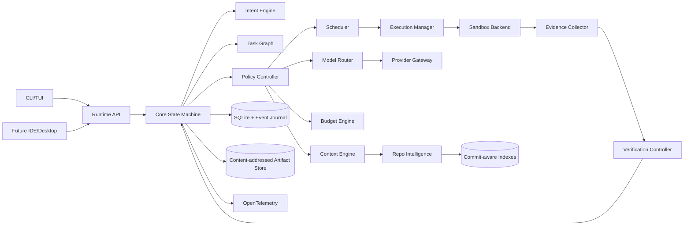

# System Architecture

## 1. Architectural style

AER uses a **library + local service + isolated workers** architecture.

The recommended implementation split is:

- `aer-core`: deterministic domain library and state machines;
- `aerd`: local runtime daemon / app server;
- `aer`: CLI/TUI client;
- worker processes or sandboxes for model-driven execution;
- optional external clients (IDE, desktop, CI) that use the same local/remote runtime API.

This mirrors a useful industry pattern: keep the agent loop and persistence in a reusable core/runtime, while clients remain replaceable.

## 2. Recommended language strategy

### Core runtime: Rust

Use Rust for the core runtime unless an implementation-stage benchmark disproves the choice.

Reasons:

- strong memory safety for a tool-executing daemon;
- efficient concurrent scheduling;
- cross-platform static/single-binary distribution potential;
- good process and filesystem control;
- low overhead for local-first operation;
- explicit type system suits IR/state/protocol contracts.

The core MUST NOT require Python for basic operation.

### Extension SDKs

Provide thin SDKs later for:

- TypeScript/JavaScript — ecosystem integrations and UI/plugin authors;
- Python — research policies, experimental evaluators, ML retrieval components.

Extension languages MUST interact through stable protocol boundaries rather than being linked into core correctness logic.

## 3. Main components



## 4. Control plane vs data plane

### Control plane

Owns decisions:

- intent resolution,
- task graph,
- routing,
- context policy,
- budgets,
- scheduling,
- verification policy,
- recovery,
- acceptance.

### Data / execution plane

Performs work:

- model calls,
- shell commands,
- source edits,
- build/test execution,
- browser or external tool calls,
- worktree changes.

The execution plane MUST NOT promote its own result to accepted state.

## 5. Durability model

AER should be resumable after process termination.

Every material transition is appended to an event journal before the corresponding external effect is considered durable.

Examples:

- task created,
- task leased,
- model call started/completed,
- worktree created,
- file mutation summarized,
- command completed,
- evidence recorded,
- verifier verdict,
- task accepted,
- policy changed.

Large payloads are stored content-addressed; events store hashes and metadata.

## 6. Runtime API

Prefer a typed API generated from a schema. A practical initial choice is Protocol Buffers with gRPC over loopback for the daemon boundary, while domain files remain JSON/YAML-friendly.

Requirements:

- streaming events,
- cancellation,
- resumability,
- request IDs,
- protocol versioning,
- local authentication token,
- future remote transport compatibility.

A direct in-process mode MAY exist for tests.

## 7. Concurrency model

The daemon is the single coordinator for one AER state directory.

Workers are isolated processes/sandboxes. They do not mutate authoritative state directly. They emit results/events to the coordinator.

Use leases with deadlines for running tasks. On daemon restart, expired leases become recoverable rather than silently assumed successful.

## 8. Repository identity

A repository snapshot is identified by:

- repository canonical ID,
- base commit hash,
- worktree branch/commit,
- dirty diff hash when applicable.

Every context pack and evidence record MUST bind to a repository identity.

## 9. Storage boundaries

Recommended local layout:

```text
.aer/
  state.db
  objects/
  indexes/
  worktrees/
  runs/
  logs/
  tmp/
```

`state.db` stores normalized metadata and event journal. Large tool outputs, compressed traces, patches, screenshots, and context artifacts belong in `objects/` addressed by cryptographic hash.

## 10. External standards

AER should support standards at boundaries without forcing them internally:

- **MCP 2026-07-28** adapter for tools/resources/prompts and Tasks extension where appropriate;
- **A2A v1.0** gateway for interoperability with remote autonomous agents;
- **OpenTelemetry GenAI semantic conventions** for tracing and cost/usage telemetry.

Internal hot-path execution should use AER's own typed Tool ABI and Handoff ABI; protocol adapters translate at boundaries.

## 11. Architectural evolution

The system should scale in this order:

1. one local process + one sandboxed worker;
2. local daemon + multiple isolated workers;
3. optional remote sandbox workers;
4. optional distributed scheduling.

Do not begin at stage 4.
