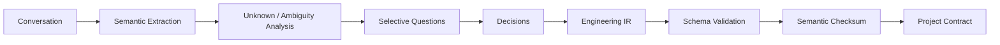

# Engineering IR — Canonical Project Representation

## Purpose

Engineering IR is the **model-independent source of truth for intended system behavior and engineering constraints**.

It prevents the project from depending on one enormous generated prompt or an ever-growing conversation transcript.

## Design requirements

Engineering IR MUST be:

- versioned,
- schema validated,
- diffable,
- partially loadable,
- human inspectable,
- machine addressable by stable IDs,
- explicit about uncertainty,
- provenance linked,
- backward-migratable between schema versions.

## Top-level structure

```yaml
schema_version: 1
project:
  id: ...
  title: ...
  summary: ...

goals: []
non_goals: []
stakeholders: []
user_flows: []
functional_requirements: []
quality_attributes: []
constraints: []
invariants: []
acceptance_criteria: []
interfaces: []
data_contracts: []
security_privacy: []
performance_targets: []
compatibility: []
risks: []
decisions: []
unknowns: []
assumptions: []
research_findings: []
```

See `schemas/engineering-ir.schema.json` for the executable baseline.

## Stable identifiers

Every material requirement and criterion receives an immutable ID, e.g.:

```text
REQ-AUTH-001
QA-LATENCY-003
INV-DATA-002
AC-WS-014
DEC-DB-001
```

Text may change while identity remains stable through revisions.

This enables evidence and tasks to reference semantics without copying prose.

## Requirement object

A requirement should include:

```yaml
id: REQ-...
statement: ...
source_refs: [...]
priority: must|should|could
status: proposed|accepted|deprecated
risk: low|medium|high|critical
verification_strategy: [...]
dependencies: [...]
```

## Acceptance criteria

Acceptance criteria MUST aim to be observable.

Bad:

> The interface should be fast.

Better:

```yaml
id: AC-UI-004
statement: "Cached dashboard navigation reaches interactive state within 250 ms p95 on the reference profile."
measure:
  metric: interaction_ready_ms
  percentile: 95
  threshold: 250
```

## Invariants

Invariants describe properties that no task may silently violate.

Examples:

- customer secrets are never written to model prompts;
- public API compatibility must be preserved through v1.x;
- database migrations are forward-only in production;
- one durable task may have at most one active execution lease.

The Task Graph and Verification Controller consume invariants directly.

## Provenance

Each semantic item may cite:

- user message event ID,
- research artifact hash,
- repository source range,
- ADR,
- test/evidence record.

Provenance is essential for semantic checksum, audit, and later conflict resolution.

## Partial materialization

Models SHOULD NOT receive the full IR by default.

A Context Pack may select:

- project summary,
- task-relevant requirements,
- directly related invariants,
- acceptance criteria,
- decisions affecting the touched subsystem,
- unresolved unknowns relevant to the task.

## Versioning

IR versions form a monotonic project history:

```text
IR v1 --delta--> IR v2 --delta--> IR v3
```

A task binds to the IR version it was planned against. If a newer delta invalidates its assumptions, it becomes stale.

## No silent model additions

A model may propose an inferred requirement. It must be tagged `proposed` with rationale. It MUST NOT become an accepted user requirement unless policy permits a safe system default or the user confirms it.

## Compilation pipeline



## Why IR rather than “perfect prompt”

A giant prompt:

- couples semantics to one model/context window,
- is hard to diff,
- loses stable identity,
- encourages repeated tokens,
- is difficult to verify incrementally.

IR allows the Handoff Compiler to render only the semantics needed by the selected model for the current task.
