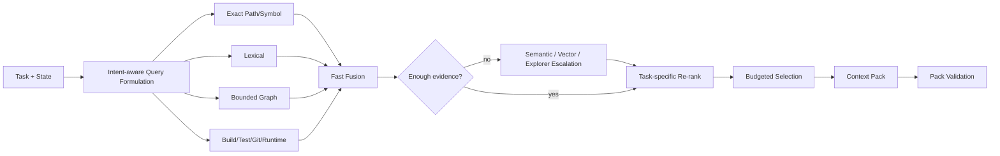

# Context Economy Engine

## Objective

For each inference, construct the **minimum sufficient, source-faithful context** that maximizes expected task value under token, latency, and attention constraints.

A large context window is not permission to fill it.

Repository Intelligence 2.0 (`06`) strengthens this engine by providing capability-tiered, provenance-bearing graph and semantic evidence. The Context Economy Engine decides **how much of that repository knowledge is worth paying to retrieve and inject**.

## Core abstraction: Context Candidate

```text
ContextCandidate {
  id
  source_type
  source_ref
  repo_snapshot
  content_hash
  token_cost
  lexical_score
  semantic_score
  structural_score
  runtime_score
  change_score
  requirement_score
  freshness
  confidence
  capability_tier
  evidence_class
  role_summary_ref?
  redundancy_group
  expansion_handles[]
}
```

A candidate's score is never a truth claim. Exact source anchors and Repository Intelligence provenance remain available behind the candidate.

## Retrieval pipeline



The default order is deliberately cost-sensitive. Cheap deterministic retrieval SHOULD run before expensive embedding/model/semantic exploration unless task policy already proves that the expensive source is required.

## Retrieval fusion

Research indicates no one retrieval family wins across repository-context tasks. Therefore fusion SHOULD combine complementary lexical, structural, semantic, temporal and runtime evidence rather than choosing a universal retriever.

A robust starting point is Reciprocal Rank Fusion (RRF) across retrieval families, followed by task-specific re-ranking.

Example feature score:

```text
utility(c) =
    wL * lexical(c)
  + wS * semantic(c)
  + wG * structural(c)
  + wR * runtime(c)
  + wC * change_ripple(c)
  + wQ * requirement(c)
  + wF * freshness(c)
  + wP * provenance_strength(c)
  - wD * redundancy(c)
  - wU * uncertainty_penalty(c)
  - wT * normalized_token_cost(c)
```

Weights MUST be policy-versioned and measured, not presented as universal constants.

## Query formulation

Repository queries SHOULD be derived from the task and current engineering state, not copied literally from the user's sentence.

Query formulation can include:

- exact identifiers, paths, stack frames and error strings;
- requirement vocabulary and known aliases;
- suspected subsystem/package names;
- likely test/build targets;
- previous failure fingerprints;
- graph relations such as callers, implementations, dependents or tests-for;
- changed-file ripple from the current diff.

An LLM MAY reformulate a difficult query, but deterministic identifiers and source evidence take precedence. Query expansion is itself bounded and observable.

## Repository-explorer separation

For difficult repository tasks, AER MAY use a dedicated exploration worker/model whose job is **localization, not solution generation**.

The explorer receives bounded Repository Intelligence tools and returns:

```text
ExplorerResult {
  repo_snapshot
  ranked_source_anchors[]
  symbol_ids[]
  relevance_reasons[]
  graph_paths[]
  unresolved_questions[]
  confidence
}
```

The solver does not inherit the explorer's entire transcript. It receives only the compact, source-anchored result plus any exact spans selected by the Context Engine.

This prevents exploratory grep/read noise from consuming the solver's attention budget while preserving inspectable provenance.

## Budgeted selection

Selection is approximately a constrained optimization:

```text
maximize   Σ selected utility(c) + coverage_bonus
subject to Σ token_cost(c) <= context_budget
           mandatory semantic constraints are covered
           mandatory provenance strength is satisfied
           redundancy caps are respected
```

V1 MAY use a greedy marginal-utility-per-token heuristic with coverage constraints. Later versions may learn selection policies, but learned selection cannot weaken hard freshness/provenance requirements.

## Context tiers

Use progressive disclosure:

### Tier 0 — identifiers

Paths, symbol names, hashes, test IDs, graph node IDs, capability/freshness metadata.

### Tier 1 — retrieval representations

Signatures, imports, role-aware file/symbol summaries, class/module skeletons, exact failure excerpts, compact graph paths and concise source-grounded notes.

### Tier 2 — exact source spans

Full relevant functions/classes/config blocks with line/source anchors.

### Tier 3 — expanded neighborhood

Adjacent implementation, callers/callees, implementations, build/test topology, dependent modules and broader docs only when evidence demands it.

Start low and escalate just in time.

### Exactly named identifiers are not subject to tier economics

When a task names an identifier explicitly and asks for its concrete
definition or value, progressive disclosure does not apply to that identifier.
The request carries the named identifiers as mandatory coverage, and the engine
MUST either:

1. include the exact defining source span, verbatim and untruncated; or
2. fail closed with an explicit abstention.

A nearby structural span, a window centred on a lexical anchor, or a
tier-limited excerpt that omits the requested assignment is NOT coverage.

Mandatory definitions are reserved before discretionary selection, so budget
pressure removes optional evidence first and can never quietly shrink a named
definition. Fail-closed conditions are:

- the identifier resolves to no definition in the exact snapshot;
- it resolves to more definitions than policy allows to be treated as one
  answer (genuine ambiguity);
- its definition is longer than the verbatim bound policy permits;
- the remaining token budget cannot hold it.

Identifier demands are derived conservatively. Only code-shaped names promote
to mandatory coverage, and only when the repository actually defines them, so
quoted prose in a task cannot turn a valid request into an abstention.

### Expansion handles

A compact candidate SHOULD expose handles that allow exact escalation without rerunning broad discovery, for example:

```text
expand_source(symbol_id)
expand_callers(symbol_id, depth=1)
expand_test_neighborhood(target_id)
expand_history(entity_id)
```

This is the repository equivalent of an index/table-of-contents first, page-content second interaction.

## Role-aware representations

Recent repository-localization evidence suggests that compact descriptions of a file's or symbol's **role** can be more cost-effective retrieval representations than raw source alone.

AER MAY therefore maintain derived role-aware representations such as:

```text
path
primary responsibility
public surface / key symbols
important dependencies
important dependents
owned data / side effects
tests
source anchors
source hash
producer version
```

Rules:

- they are retrieval aids, not authority;
- they are regenerated or invalidated when their source/dependency scope changes;
- they retain exact source anchors;
- a decision-critical edit must be grounded in exact source/evidence, not only a role summary;
- model-generated representations carry explicit producer/provenance metadata.

## Compression policy

Prefer **extractive compression** over abstractive compression for source-of-truth code.

Allowed safe transformations:

- omit unrelated declarations while preserving line anchors;
- show signatures and exact selected bodies;
- collapse repetitive logs with deterministic counts;
- retain exact error frames and commands;
- represent a graph traversal as the minimal path plus edge provenance;
- store the full artifact outside context and reference its hash.

Abstractive summaries are allowed for trajectory/history and retrieval representation, but MUST retain provenance references.

Research on repository context compression is promising, including learned/latent compression, but AER does not allow opaque compressed state to replace source-addressable engineering evidence. New compression modes enter through evaluation and policy gates.

## Context Pack

Every model call receives a versioned pack:

```text
ContextPack {
  pack_id
  task_id
  engineering_ir_version
  repo_snapshot
  repository_index_version
  policy_version
  budget
  items[]
  omitted_high_rank_items[]
  source_hashes[]
  retrieval_trace_ref
}
```

This makes retrieval decisions reproducible.

## Pack coverage and proof of relevance

A Context Pack SHOULD be inspectable not only for **what** was selected but **why**.

For important items retain:

- retrieval families that surfaced it;
- graph path/relation when structural retrieval contributed;
- requirement/test/runtime connection when relevant;
- freshness/capability tier;
- token cost at selection time.

This enables post-task analysis of whether retrieval was useful or merely plausible-looking.

## Compression verification

When an abstractive summary is used for a decision-critical handoff, AER SHOULD run a low-cost fidelity check against the source. High-risk summaries require stronger checking.

The checker flags:

- unsupported claims;
- omitted blockers;
- changed numbers/identifiers;
- lost negation/prohibitions;
- uncertainty converted into fact;
- stale source hashes;
- semantic relationships stated more strongly than their Repository Intelligence evidence class permits.

## Context caching

Provider prompt caching MAY be exploited, but the Context Engine must not distort semantic selection merely to maximize cache hits.

Stable reusable prefixes can include:

- compact system contract;
- tool definitions;
- stable project rules.

Task-specific evidence should remain dynamic.

### Model-visible cache identity versus audit identity

AER MUST distinguish **what the model needs to see** from **what the control plane needs to audit**.

Repository snapshots, pack IDs, full-file hashes, fragment hashes and source line offsets remain mandatory provenance in receipts and Context Pack state. They MUST NOT be injected into provider-visible prompt bytes solely for audit purposes when they carry no task semantics. Otherwise an unrelated workspace edit can invalidate an otherwise identical prompt prefix and destroy provider-cache reuse without improving model quality.

Therefore:

- provider-visible cache identity is derived from the exact semantic bytes supplied to the model;
- audit identity remains snapshot- and provenance-bound out of band;
- if unrelated workspace churn changes `repo_snapshot`/`pack_id` but the selected model-visible evidence is byte-identical, the provider prompt digest SHOULD remain identical;
- if a selected authority fragment or selected task source changes, the provider prompt digest MUST change;
- cache optimization never permits stale evidence reuse: exact-snapshot compilation and fidelity verification still run before dispatch.

This separation must be regression-tested with synthetic unselected workspace churn and then validated with real provider cache-write/read telemetry.

Repository-side caches SHOULD key derived retrieval representations on content/source scope plus producer policy/version. Expensive embeddings and role summaries are lazy; exact lexical/syntax/graph facts needed for freshness are prioritized.

## Context effectiveness telemetry

After each task, mark whether context items were:

- directly used in edits;
- referenced in reasoning/output;
- associated with successful evidence;
- followed by requests for missing information;
- misleading/stale;
- unnecessarily expanded;
- discoverable more cheaply from another retrieval family.

Measure at least:

```text
relevant_file_hit@k
relevant_symbol_or_line_recall
relevant_lines_per_1k_tokens
exploration_tokens
solver_tokens
post_seed_tool_calls
time_to_first_relevant_source
retrieval_latency
pack_build_latency
verified_task_success
```

This becomes training/evaluation data for future context policies.

## Anti-patterns

Do not:

- inject the whole repo map every turn;
- dump a large graph into the prompt;
- carry full exploration/tool output forward indefinitely;
- summarize source code without source anchors and then delete the original reference;
- optimize similarity score without token cost;
- assume embeddings are always superior to lexical/structural retrieval;
- invoke an expensive semantic/model retriever when exact identifiers already satisfy the task;
- let a compact summary upgrade an `inferred` graph edge into an exact fact;
- preserve stale role summaries merely because provider prompt caching is convenient.
