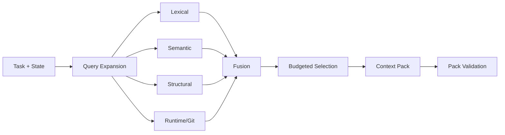

# Context Economy Engine

## Objective

For each inference, construct the **minimum sufficient, source-faithful context** that maximizes expected task value under token, latency, and attention constraints.

A large context window is not permission to fill it.

## Core abstraction: Context Candidate

```text
ContextCandidate {
  id
  source_type
  source_ref
  repo_snapshot
  content_hash
  token_cost
  lexical_score
  semantic_score
  structural_score
  runtime_score
  change_score
  requirement_score
  freshness
  confidence
  redundancy_group
}
```

## Retrieval pipeline



## Retrieval fusion

Research indicates no one retrieval family wins across repository-context tasks. Therefore initial fusion SHOULD combine rank-based and feature-based signals.

A robust starting point is Reciprocal Rank Fusion (RRF) across retrieval families, followed by task-specific re-ranking.

Example feature score:

```text
utility(c) =
    wL * lexical(c)
  + wS * semantic(c)
  + wG * structural(c)
  + wR * runtime(c)
  + wC * change_ripple(c)
  + wQ * requirement(c)
  + wF * freshness(c)
  - wD * redundancy(c)
  - wU * uncertainty_penalty(c)
```

Weights MUST be policy-versioned and measured, not presented as universal constants.

## Budgeted selection

Selection is approximately a constrained optimization:

```text
maximize   Σ selected utility(c) + coverage_bonus
subject to Σ token_cost(c) <= context_budget
           mandatory semantic constraints are covered
           redundancy caps are respected
```

V1 MAY use a greedy marginal-utility-per-token heuristic with coverage constraints. Later versions may learn selection policies.

## Context tiers

Use progressive disclosure:

### Tier 0 — identifiers

Paths, symbol names, hashes, test IDs, short metadata.

### Tier 1 — structural summaries

Signatures, imports, class/module skeletons, exact failure excerpts, concise source-grounded notes.

### Tier 2 — source spans

Full relevant functions/classes/config blocks.

### Tier 3 — expanded neighborhood

Adjacent implementation, dependent modules, broader docs only when evidence demands it.

Start low and escalate just in time.

## Compression policy

Prefer **extractive compression** over abstractive compression for source-of-truth code.

Allowed safe transformations:

- omit unrelated declarations while preserving line anchors;
- show signatures and exact selected bodies;
- collapse repetitive logs with deterministic counts;
- retain exact error frames and commands;
- store full artifact outside context and reference its hash.

Abstractive summaries are allowed for trajectory/history but MUST retain provenance references.

## Context Pack

Every model call receives a versioned pack:

```text
ContextPack {
  pack_id
  task_id
  engineering_ir_version
  repo_snapshot
  policy_version
  budget
  items[]
  omitted_high_rank_items[]
  source_hashes[]
}
```

This makes retrieval decisions reproducible.

## Compression verification

When an abstractive summary is used for a decision-critical handoff, AER SHOULD run a low-cost fidelity check against the source. High-risk summaries require stronger checking.

The checker flags:

- unsupported claims,
- omitted blockers,
- changed numbers/identifiers,
- lost negation/prohibitions,
- uncertainty converted into fact.

## Context caching

Provider prompt caching MAY be exploited, but the Context Engine must not distort semantic selection merely to maximize cache hits.

Stable reusable prefixes can include:

- compact system contract,
- tool definitions,
- stable project rules.

Task-specific evidence should remain dynamic.

## Context effectiveness telemetry

After each task, mark whether context items were:

- directly used in edits,
- referenced in reasoning/output,
- associated with successful evidence,
- followed by requests for missing information,
- misleading/stale.

This becomes training data for future context policies.

## Anti-patterns

Do not:

- inject the whole repo map every turn;
- carry full tool output forward indefinitely;
- summarize source code without source anchors and then delete the original reference;
- optimize similarity score without token cost;
- assume embeddings are always superior to lexical/structural retrieval.
