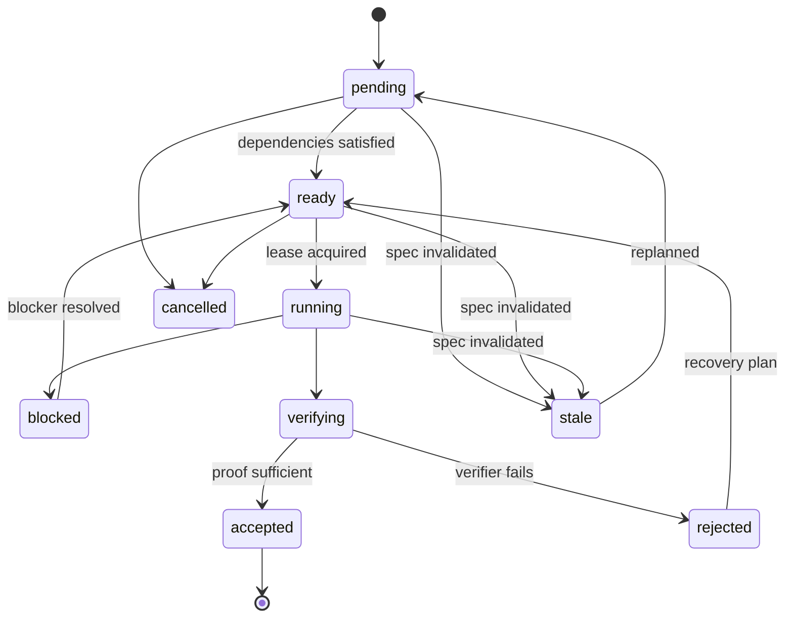

# Task Graph and Orchestration

## Objective

Compile Engineering IR into a dependency-aware graph of verifiable engineering work, and execute it using the least complex topology that is likely to succeed.

## Task types

Core task kinds:

```text
research
specification
architecture
implementation
migration
integration
verification
security_review
performance_review
documentation
recovery
```

The type influences routing and verifier composition but does not imply a fixed agent role.

## Task object

A task contains:

```text
task_id
kind
objective
requirement_refs[]
acceptance_refs[]
invariant_refs[]
dependencies[]
expected_read_scope
expected_write_scope
risk
uncertainty
budget
state
spec_version
repo_snapshot
```

See `schemas/task.schema.json`.

## State machine



## Decomposition policy

Tasks SHOULD be decomposed when doing so creates independently verifiable semantic units.

Bad decomposition:

- arbitrary “frontend agent / backend agent” split with shared contracts not yet defined;
- one task per file;
- decomposition purely to increase parallelism.

Good decomposition:

- API contract first, then independent client/server implementations;
- migration tooling separate from application behavior when independently testable;
- research spike separate from implementation when uncertainty is high.

## Default topology

Start with one active model worker.

The scheduler MAY introduce parallel workers when all are true:

1. dependency graph contains ready independent nodes;
2. predicted write-set overlap is low;
3. shared contracts are stable;
4. each node has local verification;
5. integration cost is lower than expected parallel speed/quality gain.

## Dynamic replanning

The task graph is not immutable.

New evidence may:

- split a task,
- add a prerequisite,
- invalidate a task,
- reveal a new test requirement,
- reduce a planned task to deterministic tooling.

Replanning MUST preserve requirement/evidence traceability.

## No agent-role theater

AER should not permanently instantiate “Planner, Coder, Reviewer, Tester” personas.

Instead it creates ephemeral **work intents** with required capabilities. A selected model receives a task envelope and appropriate tools.

## Scheduling priority

A reasonable starting priority score:

```text
priority =
  unblock_value
  + critical_path_weight
  + risk_reduction_value
  + information_gain_value
  - expected_cost
  - merge_conflict_risk
```

Do not treat this formula as final learning policy.

## Spec changes

Each task binds to an Engineering IR version. A SpecDelta runs impact analysis. Tasks affected by changed requirements/invariants become stale before further integration.

## Completion

A task is not complete when the model stops. It is complete only after the Verification Controller emits an accepted verdict and a Proof Manifest fragment is persisted.
