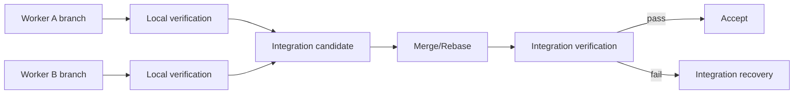

# Parallelism, Worktrees, and Integration

## Principle

Parallelism is a conditional optimization, not a product checkbox.

Recent long-horizon multi-agent software-engineering work supports dependency-aware tasks plus isolated git branches/worktrees as a reliable coordination primitive. AER adopts that pattern while remaining conservative about when it pays off.

## Isolation model

Each writable task receives:

- dedicated branch,
- dedicated git worktree,
- task-specific sandbox,
- task-specific ephemeral services where practical,
- independent logs/traces.

Workers MUST NOT edit the user's main working tree concurrently.

## Write-set prediction

Before parallel scheduling, estimate expected write scopes from:

- task decomposition,
- repository graph,
- historical co-change,
- requirement ownership,
- referenced symbols.

Write-set prediction is advisory. Runtime detects actual overlap.

## Integration sequence

## Merge policy

Never accept parallel work merely because each branch passes its own tests.

After merge, run integration-aware verification including:

- cross-module tests,
- contract tests,
- dependency/architecture checks,
- relevant performance/security checks.

## Conflict handling

### Textual conflict

Use deterministic git conflict detection first. A model may resolve only after receiving both semantic intents and affected evidence.

### Semantic conflict without textual conflict

Detect through:

- overlapping requirement ownership,
- public API changes,
- schema changes,
- architecture graph deltas,
- failing integration tests.

These are more dangerous than ordinary merge markers.

## Integration agent

An integration-specialized model invocation MAY be used for nontrivial conflicts. It receives:

- parent task intents,
- accepted branch evidence,
- exact diffs,
- shared constraints,
- integration failures.

It does not receive irrelevant full transcripts.

## Parallelism limits

Global scheduler enforces:

- maximum workers,
- provider rate limits,
- CPU/memory/disk quotas,
- budget cap,
- branch count,
- high-risk serialization rules.

## When to serialize

Serialize if:

- migrations depend on ordering,
- write scopes overlap heavily,
- architecture contract is unresolved,
- tasks modify the same public API/schema,
- verifier environment cannot safely isolate them,
- project is small enough that coordination dominates.

## Commit discipline

Workers SHOULD produce logical commits. Commit metadata includes task ID and run ID. Generated commit messages are not evidence themselves.
