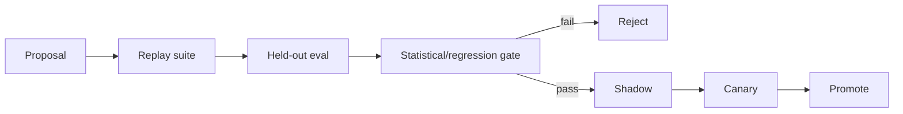

# Self-Evolution and Policy Lab

## Objective

Allow AER to improve its orchestration using execution-grounded experience without allowing the live agent to rewrite the rules that judge it.

## Non-negotiable separation

**Proposer and evaluator are separate authorities.**

A model may propose:

- routing rules,
- context weights,
- prompt/cognitive-adapter templates,
- skill changes,
- verifier compositions,
- recovery thresholds.

The proposal receives no production credit until external evaluation accepts it.

## Policy artifact

Each policy is immutable and versioned:

```text
policy_id
policy_type
parent_version
content_hash
creator
training/evidence refs
evaluation report
status
```

Statuses:

```text
candidate -> offline_passed -> shadow -> canary -> active -> retired
```

## Evaluation pipeline



## Replay

AER's event journal enables replay of past states. For model-dependent policies, exact counterfactual replay may require new model calls. Distinguish:

- deterministic replay,
- simulated/cached counterfactual,
- fresh counterfactual execution.

Never mislabel one as another.

## Held-out protection

Evaluation tasks used for promotion should not be fully visible to the proposing model/process. Verifier/policy code under evaluation cannot modify the held-out judge.

## Optimization targets

Multi-objective evaluation includes:

- verified success,
- cost,
- latency,
- architecture health,
- security failures,
- intervention rate,
- regression rate.

A policy that saves 20% tokens but loses 5% critical-task correctness may be unacceptable.

## Learning roadmap

### Stage 1 — manually authored deterministic policy

Build telemetry.

### Stage 2 — offline data analysis

Discover correlations and failure classes.

### Stage 3 — model-proposed policy candidates

Human/eval-controlled promotion.

### Stage 4 — constrained learned routing/retrieval

Contextual bandits/value models with safe fallback.

### Stage 5 — broader harness co-evolution

Only after evaluation robustness is demonstrated.

## No online self-modifying core

The live production runtime MUST NOT autonomously patch its executable/core policy and immediately continue under the new rules.

Self-improvement is a release/evaluation pipeline, not an unchecked reflection loop.
