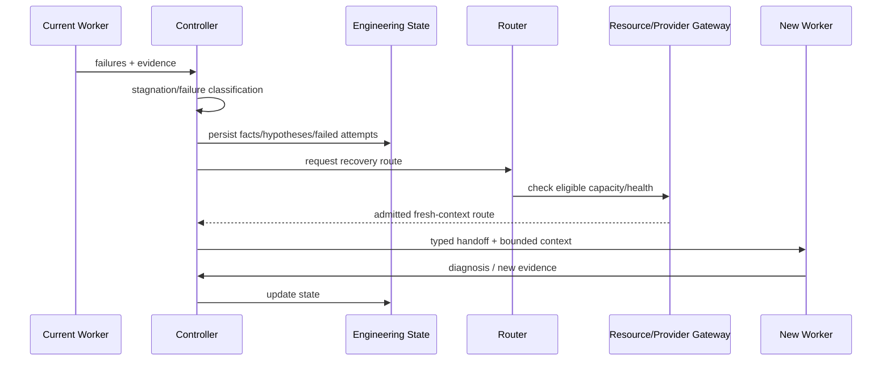

# End-to-End Runtime Sequence

This document shows how subsystems coordinate during realistic project work.

## A. New greenfield project

### 1. Start

```text
user -> CLI -> daemon -> compatibility/preflight -> project.created
```

Startup validates durable-state compatibility and resource/runtime health before write-mode execution.

### 2. Intent elicitation

Intent Engine receives the user goal and uses an eligible language/product-reasoning model when useful.

The model outputs structured semantic candidates/unknowns rather than an implementation mega-prompt.

The engine asks only high-value questions.

### 3. Research unresolved external facts

Unknowns marked `research` create bounded research tasks.

```text
question
 -> source discovery
 -> provenance/safety classification
 -> claim extraction
 -> contradiction/corroboration
 -> ResearchArtifact
```

External claims remain evidence with time/freshness semantics. They do not automatically become user requirements.

### 4. Engineering IR compilation

Resolved semantics become IR v1.

- schema + semantic validation;
- semantic checksum against user source messages for medium/high risk;
- project contract becomes active.

### 5. Initial architecture/task graph

A planning-capable model may propose architecture/tasks. Deterministic validation checks:

- stable IDs;
- dependency DAG;
- requirement/acceptance coverage;
- invariant references;
- authority/resource assumptions.

### 6. Repository/workspace bootstrap

For existing repositories:

- capture user-owned Workspace Snapshot;
- do not reset/stash/discard dirty changes;
- identify base/upstream/submodule state;
- create AER-owned isolated writable worktree.

For an empty repo, create minimal bootstrap under AER ownership.

### 7. Repository intelligence and Context Pack

```text
Task + IR slice + repo/workspace state + Engineering State
 -> multi-view retrieval
 -> fusion
 -> budgeted selection
 -> schema/semantic validation
 -> Context Pack
```

### 8. Routing and resource admission

Router evaluates eligible models.

A cheap bounded scout may gather repository evidence first.

Before execution, Resource Governor checks:

- task/run/org budgets;
- worker/sandbox capacity;
- provider quotas/health;
- disk/memory/process/network constraints;
- serialization/integration policy.

No capacity means queued/ready, not uncontrolled spawn.

### 9. Handoff + provider execution

Task + Context Pack + Engineering State become Handoff Envelope.

Cognitive Adapter renders the model-specific request.

Provider Gateway owns normalized:

- attempt identity;
- streaming;
- structured-output/tool-call validation;
- cancellation;
- retry/rate-limit behavior;
- health/circuit state.

### 10. Sandbox execution and environment identity

Worker acts only within admitted sandbox/worktree authority.

Tool/dependency/package operations go through Tool ABI/security/network policy.

Relevant toolchain, lockfile, sandbox/service/platform state becomes an Environment Fingerprint.

Large outputs become content-addressed artifacts. Worker claims return as untrusted WorkResult.

### 11. Verification

Verification Controller composes gates using:

- task risk/type;
- Engineering IR;
- Domain Profiles;
- Environment Fingerprint;
- architecture/security policy.

Deterministic evidence is preferred. Independent semantic verifier/held-out checks are added when required.

### 12. Acceptance

If proof is sufficient:

- Proof Manifest fragment persisted;
- verified facts promoted to Engineering State;
- task accepted;
- repository snapshot/index updated;
- architecture-health time series updated;
- resource reservations released/reconciled;
- dependent tasks become ready.

If insufficient:

- task rejected;
- evidence/failure/hypotheses updated;
- Recovery Controller chooses minimal escalation.

### 13. Long-horizon evolution

Spec changes create SpecDelta and invalidate affected tasks/evidence.

Repository, dependency, environment, provider or external-fact changes invalidate their dependent cached facts/evidence according to policy.

### 14. Completion

Project completion requires current accepted proof for required Engineering IR semantics, not an empty task queue.

The CLI presents requirement/evidence state rather than agent activity.

---

## B. Failure and fresh-model takeover



The new worker does not inherit the whole old transcript by default.

---

## C. Parallel feature execution

1. Task graph exposes independent ready nodes.
2. Scheduler checks write-set/contract stability.
3. Resource Governor admits bounded workers.
4. Separate worktrees/sandboxes/services are created.
5. Each branch receives local verification.
6. Integration candidate combines accepted branch changes.
7. Semantic/textual conflicts are resolved with parent intents/evidence.
8. Cross-module/domain verification runs.
9. Only merged current evidence can complete parent requirements.
10. Owned resources/worktrees are cleaned after durable integration/reconciliation.

---

## D. User changes requirement mid-run

1. User message creates semantic input event.
2. Intent Engine compiles `SpecDelta`.
3. IR vN+1 validates.
4. Impact analysis finds tasks/evidence depending on changed semantics.
5. Running affected tasks receive cancellation/stale transition at safe boundary.
6. Accepted code may create remediation tasks rather than remaining silently valid.

---

## E. Provider outage or rate limit

1. Provider Gateway classifies the error.
2. Resource Governor updates quota/health state.
3. Retry occurs only if retry-safe and within budget.
4. Circuit/open or reset window prevents request storms.
5. Failover candidate is re-filtered for privacy/capabilities/cost.
6. Typed Handoff/attempt state preserves continuity.
7. Non-idempotent external effects are reconciled before repeat.

Provider failure is execution state, not reason to lose project state.

---

## F. Dependency/environment change

1. Lockfile/toolchain/service/sandbox identity changes.
2. New Environment Fingerprint produced.
3. Evidence/cache dependencies compare fingerprints.
4. Affected evidence becomes stale/ineligible for current proof.
5. Verification reruns only the invalidated surface according to dependency graph.
6. Security/advisory refresh may invalidate security acceptance without rewriting historical build truth.

---

## G. AER binary upgrade

1. New binary reads compatibility metadata before normal write mode.
2. Supported version/migration path is resolved.
3. Preflight + durable backup/checkpoint runs.
4. Migration executes in staged/transactional form.
5. Postconditions/replay invariants validate.
6. Runtime enters normal mode or explicit recoverable migration failure.
7. CLI/daemon negotiate API/features.

A binary must not silently reinterpret old events/IR because its code changed.
