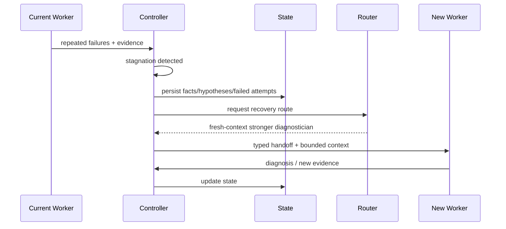

# End-to-End Runtime Sequence

This document shows how the subsystems coordinate during a realistic project.

## A. New greenfield project

### 1. Start

```text
user -> CLI -> daemon -> project.created event
```

No coding model is called yet.

### 2. Intent elicitation

Intent Engine sends the user request to a language/product-reasoning model selected by the router.

The model outputs structured semantic candidates and unknowns, not an implementation prompt.

The engine computes material ambiguities and asks only high-value questions.

### 3. Engineering IR compilation

Resolved semantics become IR v1.

- schema validation runs;
- semantic checksum compares IR against user source messages for medium/high-risk projects;
- project contract becomes active.

### 4. Initial architecture/task graph

A planning-capable model may propose architecture/tasks, but deterministic rules validate:

- stable IDs,
- dependency DAG,
- requirement coverage,
- invariant references,
- cyclic dependency errors.

### 5. Repository/bootstrap work

For an empty repo, the task begins with minimal bootstrap. For an existing repo, Repo Intelligence indexes the base commit.

### 6. Context selection

For each ready task:

```text
Task + IR slice + repo state
 -> candidate retrieval
 -> fusion
 -> budgeted selection
 -> Context Pack
```

### 7. Routing

Router evaluates eligible models and budget.

A repository task may first receive bounded cheap scouting. Scouting evidence updates task features before final routing.

### 8. Handoff compilation

Task + Context Pack + Engineering State become a Handoff Envelope.

The selected model's Cognitive Adapter renders provider-specific instructions.

### 9. Execution

Worker runs inside its sandbox/worktree.

Tool calls are mediated through Tool ABI. Large outputs become artifacts. New claims are returned as untrusted WorkResult items.

### 10. Verification

Verification Controller selects gates from task risk/type.

Deterministic evidence is collected. An independent semantic verifier is added if policy requires.

### 11. Acceptance

If sufficient:

- Proof Manifest fragment persisted;
- verified facts promoted to Engineering State;
- task accepted;
- repository snapshot updated;
- repo indexes incrementally refreshed;
- dependent tasks become ready.

If insufficient:

- task rejected;
- failure/hypothesis evidence updated;
- Recovery Controller chooses minimal escalation.

### 12. Long-horizon iteration

Each accepted change updates architecture-health time series. Spec changes create SpecDelta and invalidate affected tasks/evidence where necessary.

### 13. Completion

Project completion requires required Engineering IR requirements to have current accepted proof, not merely an empty task queue.

---

## B. Failure and fresh-model takeover



The new worker does not receive the entire old transcript unless specifically justified.

---

## C. Parallel feature execution

1. Task graph exposes two independent nodes.
2. Scheduler checks write-set/contract stability.
3. Two worktrees/sandboxes are created.
4. Each branch is independently verified.
5. Integration candidate merges both.
6. Cross-module verification runs.
7. Only merged evidence can complete parent requirement.

---

## D. User changes requirement mid-run

1. User message creates semantic input event.
2. Intent Engine compiles `SpecDelta`.
3. IR vN+1 validated.
4. Impact analysis finds tasks/evidence relying on changed semantics.
5. Pending/running affected tasks become stale or cancellation is requested.
6. Accepted code may generate remediation tasks rather than being silently treated as valid.

This sequence is why explicit spec/task/evidence identity is required.
